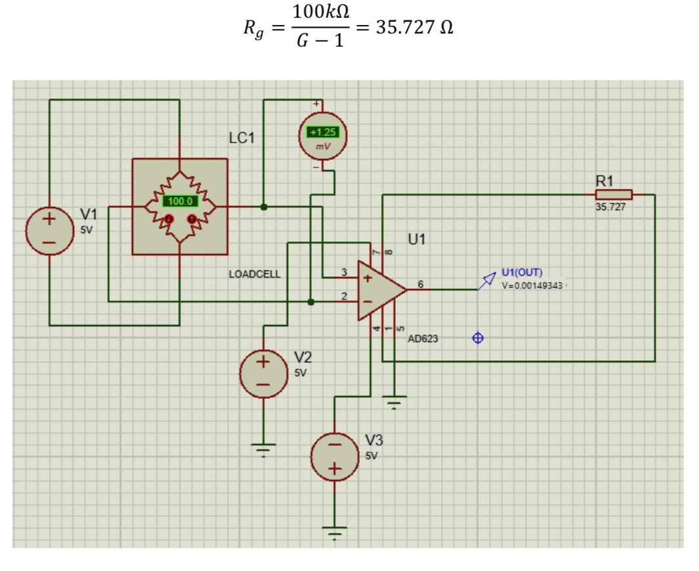

# STM32_Scale
implementation of a scale with a **loadcell** in STM32 micro-processor

In this project, an experiment was designed to determine the value of the resistor on each pin of the micro-controller. In the later steps of the project, I used an **ADC623** to convert the measured weight to a voltage.

First, I indicated the resistor values on each pin of the loadcell. Using the knowledge that the resistance on each pin is equal to **R||3R**, the resistance values are measured as below:

The AD623 circuit is as follows:

The desired component needs to convert the 1.25 mv voltage to 3.5 volts. So the gain is 2800. (G)

Using the value of the gain to find Rg:

The corresponding circuit is as follows:

Reading different Vout values corresponding to each Full Scale value, and giving the data to **cftool** in MATLAB, I used the equation along with a STM32 micro-controller to write a program to measure the temperature with the sensor. The measured temperature is later printed on an lcd display connected to the STM32 microcontroller.
